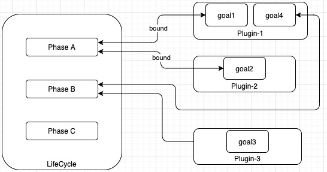
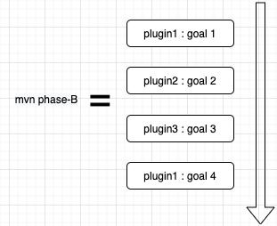

- [Apache Maven](#apache-maven)
  * [References](#references)
  * [What is Maven?](#what-is-maven)
      - [Form Factor](#form-factor)
  * [Build Manually](#build-manually)
    + [How to build a JAR](#how-to-build-a-jar)
      - [JAR Structure](#jar-structure)
    + [How to build a WAR?](#how-to-build-a-war)
      - [War Structure](#war-structure)
      - [Create war from command line](#create-war-from-command-line)
  * [Objectives](#objectives)
    + [1. Providing a uniform build system](#1-providing-a-uniform-build-system)
    + [2. Providing quality project information](#2-providing-quality-project-information)
    + [3. Providing guidelines for best practices development](#3-providing-guidelines-for-best-practices-development)
      - [Other things to note](#other-things-to-note)
  * [Execution Model](#execution-model)
    + [LifeCycle, Phases & Goals](#lifecycle-phases--goals)
      - [Hierarchical Structure](#hierarchical-structure)
    + [Execution Sequence](#execution-sequence)
  * [Build Features](#build-features)
    + [GroupId, ArtifactId, & Version](#groupid-artifactid--version)
    + [Directory Layout](#directory-layout)
    + [Dependency Management](#dependency-management)
    + [Repository Management](#repository-management)
    + [Profiles](#profiles)
    + [Other Features](#other-features)
  * [POM File](#pom-file)
  * [Archetype](#archetype)
  * [Running Goals](#running-goals)
  
# Apache Maven

## References

```
1 https://maven.apache.org
2 https://maven.apache.org/what-is-maven.html
3 https://docs.oracle.com/javase/tutorial/deployment/jar/apiindex.html
```

## What is Maven?

From wikipaedia:

>Maven is a build automation tool used primarily for Java projects. Maven can also be used to build and manage projects written in C#, Ruby,
>Scala, and other languages. The Maven project is hosted by the Apache Software Foundation, where it was formerly part of the Jakarta
>Project. ”

From [1]

>Apache Maven is a software project management and comprehension tool. Based on the concept of a project object model (POM), Maven
>can manage a project's build, reporting and documentation from a central piece of information. ”
(Software project here means code project)

To highlight, it can be used to manage project’s

1. Build
2. Reporting
3. Documentation

Focus is more on build aspect of mvn here.

#### Form Factor

mvn is a java program. It has no UI. However, it is integrated well into Intellij and other IDEs.


## Build Manually

Knowning how JARs and WARs can be built manually gives perspective of what maven or any build automation tool does.

### How to build a JAR

#### JAR Structure

https://docs.oracle.com/javase/8/docs/technotes/guides/jar/jar.html

Create jar from command-line.

```
 jar -cmf myfile.mf myjar.jar First.class
 -c creates new archive file
 -m includes manifest information from the given mf file.
 -f specifies the archive file name
```

### How to build a WAR?

#### War Structure

https://docs.oracle.com/javaee/7/tutorial/packaging003.htm

#### Create war from command line

`jar -cvf projectname.war *`


## Objectives

> Maven’s primary goal is to allow a developer to comprehend the complete state of a development effort in the shortest period of time. In
> order to attain this goal, Maven deals with several areas of concern: 


### 1. Providing a uniform build system

From [2]

> Maven builds a project using its project object model (POM) and a set of plugins. Once you familiarize yourself with one Maven project, you
> know how all Maven projects build. This saves time when navigating many projects. ”

### 2. Providing quality project information

> Dependencies used by the project
> Unit test reports including coverage

See [2]

### 3. Providing guidelines for best practices development

- Keeping test source code in a separate, but parallel source tree
- Using test case naming conventions to locate and execute tests
- Having test cases setup their environment instead of customizing the build for test preparation

See [2]

#### Other things to note

- Was built to manage Java projects but can manage other language projects
- Extensible - Plugin based

## Execution Model

On invocation, Maven executes various operations on source/test files by recursively traversing a project folder, just like any other build automation
system. E.g., Make System

However, it has a distinct execution blueprint - a hierarchical structure of operations comprising a `LifeCycle` which is at root, `Phases` which are constituent parts of `lifecycle` and `Goals` at the bottom of the tree.

On invocation, the maven tool (mvn) tranverses this operation tree. Each of the operation is applied within a project folder scope. So this would involve
each operation recursively traversing the project folder.

### LifeCycle, Phases & Goals

Maven defines 3 lifecycles - default, clean and site. `default` is the most used.

A Goal is the smallest unit of work (e.g., compile). A Phase is made up of a sequence of 0 or more goals. mvn executese goals in same sequence. A
sequence of phases make a lifecycle. mvn executes the phases in same sequence.

Goal implementations reside in plugins. A plugin may embody goals associated with different phases.

#### Hierarchical Structure



`default` lifecycle has fixed 23 phases. clean has fixed 3 phases and site has fixed 3 phases.

### Execution Sequence

mvn command line structure is `mvn <options> <phase/goal> <phase/goal> <phase/goal> ...`

mvn executes them in same order.

- If phase is specified, mvn executes all preceding phases before running the specified phase.
- If a goal is specified, mvn executes only that goal.



## Build Features

### GroupId, ArtifactId, & Version

Maven introduces GroupId, ArtifactId and version for better artifact management.

[http://maven.apache.org/guides/mini/guide-naming-conventions.html](http://maven.apache.org/guides/mini/guide-naming-conventions.html)

### Directory Layout

Prescribes a [Standard Directory Layout](https://maven.apache.org/guides/introduction/introduction-to-the-standard-directory-layout.html)

### Dependency Management

Supports declarative [Dependency Management](https://maven.apache.org/guides/introduction/introduction-to-dependency-mechanism.html). Lets maven analyse the dependencies and helps in choosing the right version and help resolve conflicts.

### Repository Management

In conjunction with versioning, repository management allows download, storing, handling and packaging of artifacts in a seamless way.

[Repository management](https://maven.apache.org/guides/introduction/introduction-to-repositories.html)

### Profiles

Allows a single project to be build in multiple ways

[Profiles to support build variations/flavors](https://maven.apache.org/guides/introduction/introduction-to-profiles.html)

### Other Features

1. [Custom behavour with plugins] (https://maven.apache.org/guides/index.html#archetypes)
2. [Archtetype](https://maven.apache.org/guides/index.html#archetypes)

## POM File

[Pom file structure](https://maven.apache.org/guides/introduction/introduction-to-the-pom.html)

A single XML file at the project and module level which defines a blueprint for mvn execution.

It contains details of


- Parent POM
- Child modules
- Artifact versioning
- Dependencies
- Repository to use
- Properties
- Plugins
- Profiles

and more.

POM files can have hierarchical structure. A super POM can be defined to capture common artifact verisons, plugin configurations, dependencies etc.

## Archetype

## Running Goals


